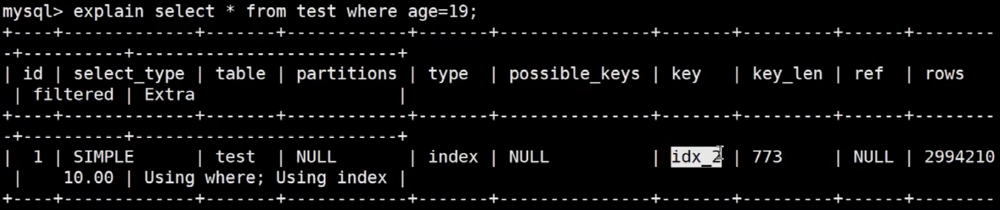

mysql client
mysql server
连接器—分析器—优化器—执行器
存储引擎（innodb、myisam、内存数据库memory）
innodb/myisam使用b树（本质是b+树），memory使用的是hash
二叉树：只有左右子节点
磁盘预读：页（4k或者8k）
b+树：只有叶子节点存数据，根节点只存key（key默认选着主键id、唯一键、6字节的rowid(不可见)）
索引：一颗b+树，叶子节点储存那列的值+id
聚簇索引：索引跟数据放在一块
innodb：索引跟数据放一块，所以是聚簇索引
myisam：存放的是索引跟地址，所以是非聚簇索引
分类： 主键索引、唯一索引、普通索引辅助索引二级索引、全文索引、组合索引联合索引
回表：拿到主键的id再取其它列的值为回表（两颗b+树）
索引覆盖（优化：Using index）：查询结果只有索引列和聚簇索引列
全文索引：5.6之后支持。没人用，可以用es代替
组合索引：一个索引包含多个列
问题：

关键列：type(查询类型)possible_keys(可能使用到的索引)key(索引)ref(索引列)Extra(额外的信息)，详见：https://blog.csdn.net/qq_36182135/article/details/84927624
1. 最左匹配：每次匹配从[组合索引]的第一个列匹配，如何where条件里没有第一个那么不走组合索引。
            注意⚠️：组合索引中包含了所有列(id,name,age)此情况不符合最左匹配，将始终走索引
2. 索引下推(ICP)：组合索引在满足多个索引列的条件的数据。
    条件： where后有两个以上的条件
    原理：5.6版本之前，先从存储引擎中获取第一个条件的所有结果，然后将结果在执行器(server)中按第二个条件筛选结果。
         5.6版本之后，根据所有条件从存储引擎中获取数据，返回结果。
    优点：减少IO次数
查看索引：show index from 表
        key_name列是索引名

主从复制的延迟：
多线程并行：MTS
2PC、组提交

tools：innblock-master 
查询表结构：desc 表；

    

表锁：selec方式上锁：
	共享锁：select * from table lock in share mode
	排他锁：select * from table for update
行锁：排他锁：select * from table where name = 'li' for update
	注意：行级锁的条件必须是索引，否则是表锁。
	
mysql排他锁的使用：
//上锁 

    public boolean lock(){
        connection.setAutoCommit(false)
        while(true){
            try{
                result = select * from methodLock where method_name=xxx for update;
                if(result==null){
                    return true;
                }
            }catch(Exception e){
                    
            }
        
            sleep(1000);
        }
        return false;
    }

//解锁

    public void unlock(){    
        connection.commit();
    }

连接者：show processlist;

隔离级别
    读未提交
    读已提交
    不可重复读
    串行化
    前提是两个事务
    脏读 Dirty Reads，一个事务在执行时修改了某条数据，另一个事务正好也读取了这条数据，并基于这条数据做了其他操作，因为前一个事务还没提交，如果基于修改后的数据进一步处理，就会产生无法挽回的损失。
    不可重复读    
    Non-Repeatable Reads，同样是两个事务在操作同一数据，如果在事务开始时读了某数据，这时候另一个事务修改了这条数据，等事务再去读这条数据的时候发现已经变了，这就是没办法重复读一条数据。
    幻读    
    Phantom Read，与上方场景相同，事务一开始按某个查询条件没查出任何数据，结果因为另一个事务的影响，再去查时却查到了数据，这种就像产生幻觉了一样，被称作幻读。
    
undo log：撤销日志

redo log：重做日志

MVCC

show create table t_dept;

show engine innodb status;

关闭自动事物：set autocommit = 0;

查慢查询日志：show variables like 'slow_query_log';
查慢查询时间：show variables like 'long_query_time';

排序后加函数：order by if()

Index类型：
    hash
    B树
    B+树

高可用：
   MHA
   MGR
   MySQL Cluster
   Orchestrator

漏数据：

    
    
    
    
    
    
    
    
    
    
    
    
    
    
    
    
    
    
    
    
    
    
    
    
    
    
    
    
    
    
    
    
    
    
    
    
    
    
    
    
    
    
    
    
    
    
    
   

